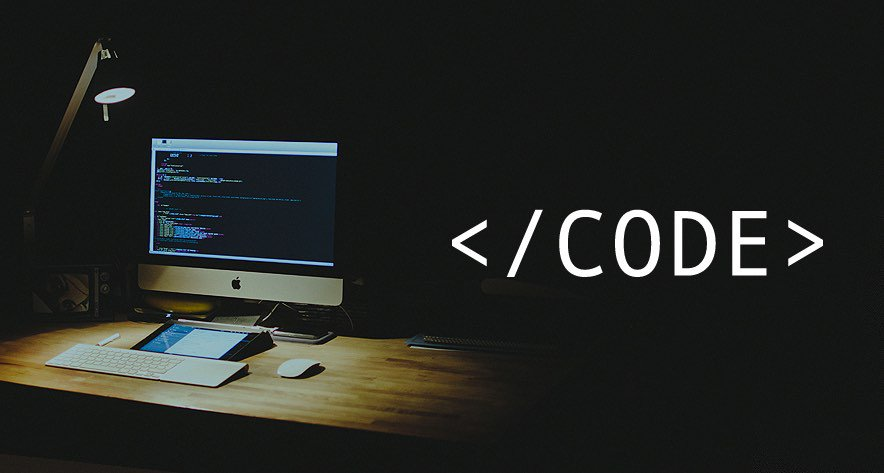

<h1 align="left"> 
    
</h1>


- 🔭 I am a Full Stack Developer with a love for JavaScript, React, Redux, and C++. I play chess and learn new languages in my spare time. Open to new opportunities.
- 📫 How to reach me:
  -   [)](https://www.linkedin.com/in/muhammaddavlatov/)
  
  - <a href='mailto:umedjon02.ud@gmail.com' target="_blank"></a>

  - <a href='https://twitter.com/MuhammadDavla20' target="_blank"></a>


### Skills


### 🚀 A little more about me...  

```javascript
const muhammadDavlatov = {
  lookingFor: "Front-end developer" || "Full-stack web developer",
  pronouns: ["he", "him"],
  code: [JavaScript, React, Redux, C++, HTML/CSS, Ruby, Ruby on Rails, SQL, HTML/CSS],
  askMeAbout: [JavaScript, React, Math],
  hobbies: [Football, Table Tennis, Chess]
}
```

<div align='left'>
  
[]()
[](https://github.com/Muhammad0602/github-readme-stats)
</div>

<p align="center"> 
  Visitor count<br>
  
</p>
